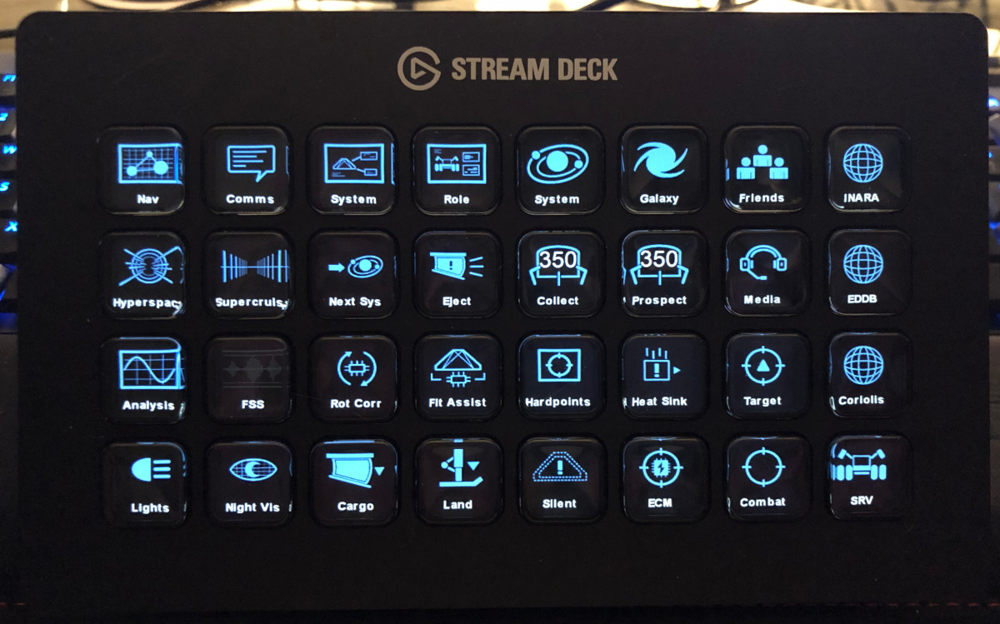
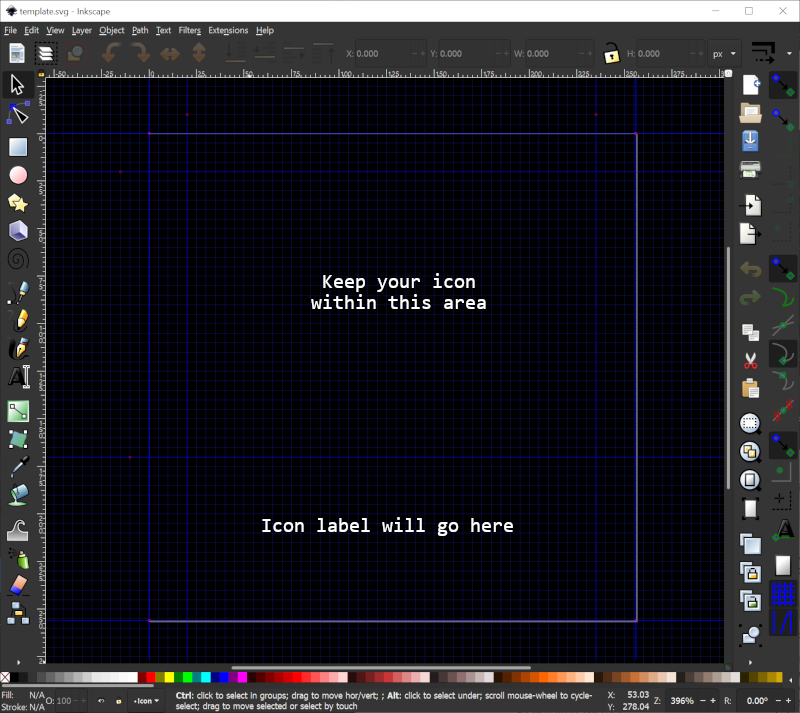

Stream Deck Elite Icon Pack
===========================

Themeable, language-neutral icons for the [Stream Deck Elite plugin](https://github.com/mhwlng/streamdeck-elite).




This project contains icons for use with the [Elgato Stream Deck](https://www.elgato.com/en/gaming/stream-deck)
family of programmable LCD button boxes that are designed to work with the [Stream Deck Elite plugin](https://github.com/mhwlng/streamdeck-elite) for Elite Dangerous.

# Features

* The SVG-based icons in this pack are themeable, allowing you to select different colors for "normal", "active", "disabled" and "alarm" states supported by the Stream Deck Elite plugin.
* Icons do not include any English text labels - rather you can use the button title functionality of the Stream Deck software to label your buttons using the terminology/language that you prefer.
* Several pre-generated icon packs are included in various themes. The automated build process allows you to easily generate new sets of custom themed icons.

# Included Icons

This icon pack includes images for most actions supported by the Stream Deck Elite plugin as well as several additional special-purpose and generic icons you may find useful while playing Elite Dangerous.

# Installation

First, install the [Stream Deck Elite Plug-In](https://github.com/mhwlng/streamdeck-elite) if you haven't already. 

Download the latest release from the [Releases](https://github.com/Ordo-Corona-Stellarum/streamdeck-elite-icons/releases) page.

To use the icons, copy the icon set of your choice to your Documents folder or some other convenient location then use the Stream Deck configuration application to drag actions onto the panel layout.

## Generic & Static Buttons

Regular Stream Deck actions and "static" actions supported by the Stream Deck Elite plug-in use a single icon. Click the down arow next to the icon and select "Set from File" then browse to the folder with your icons and find the icon that corresponds to the action. Typically, you will use the "normal" version of the icon, but you may elect to use the "active" or "alerm" versions for some actions.

All of the icons are designed to leave room at the bottom for adding a label. Enter a name for the button in the "Title" field. You may need to adjust the font size.

## Toggle Buttons

Toggle actions feature separate icons for the "ON" and "OFF" states. Typically, you will select the "active" verson of the icon for the "ON" state and the "normal" version for the "OFF" state, but you may want to reverse this in some cases - for example, Flight Assist.

## Alarm & Other Button Types

Alarm buttons feature separate "normal" and "alarm" states. Other button types support a "disabled" state. Each icon features "alarm" and "disabled" versions.

# Building a Custom Icon Set

To generate your own theme, you will need [ImageMagick](https://imagemagick.org/index.php) 7.0+ and the "magick" command must be in your path (e.g. `C:\Program Files\ImageMagick-7.0.10-Q16-HDRI`).

From the root of the streamdeck-elite-icons directory, run the built.bat file to generate a new icon set:

```
.\build.bat <theme name> <normal color> <active color> <disabled color> <alarm color>
```

Place each argument in quotes. Colors must be specified in a form recognized by ImageMagick. For example:

```
.\build.bat "Sidewinder Orange" "#FF7F00" "#f0f0f0" "#202020" "#e02020"
```

The icons will be generated into the `<theme name>` folder.

| Argument | Usage |
| --- | --- |
| **theme&nbsp;name** | Folder name where icons will be generated. This folder will be deleted before icons are re-generated. |
| **normal&nbsp;color** | Color for the "normal" state of the button. This is primary color of the theme and the only color thaty will be used by static buttons. |
| **active&nbsp;color** | Color for the "active" state of toggle and other multi-state buttons. This color should be visually distinguished from the normal color. |
| **disabled&nbsp;color** | Color for the "disabled" state of some button types. This is usually dark gray or some other muted color. |
| **alarm&nbsp;color** | Color for the "alarm" state of alarm buttons. This should be a bright, noticeable color. |

# Making New Icons

Icons can be created in [InkScape](https://inkscape.org/) or another SVG image editor. Use the `template.svg` file as a starting point. This template includes guides that will help properly format your icons so they will display well with label text:


